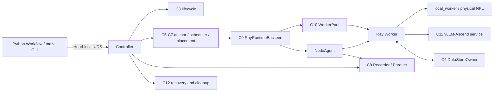

# Ascend-Maze

[English](README_EN.md) | **中文**

Ascend-Maze 是面向华为昇腾集群的任务级静态工作流运行时。项目保留 Maze 的
`@task`、命名输出和静态 DAG 编程语义，在底层重新建立了确定性编译、资源锚定、
HACS-noTP 调度、物理 NPU Placement、Standby Worker、vLLM-Ascend 模型服务、
故障恢复、可审计执行记录以及可复现实验链路。

> 当前版本为 `0.1.0` Alpha。C0-C13 correctness 已完成，C14A-C14D 已完成；
> C14E 的实验代码已经具备，但 Ascend 性能校准和正式内部消融尚未收口；C14F
> 外部基线 Adapter 尚未实现。当前没有正式性能收益结论。

## 1. 项目目标与边界

Ascend-Maze 的第一阶段目标是实现并验证 Maze 论文的核心系统机制：

- 任务级资源锚定；
- CPU、NPU、I/O 异构队列；
- FCFS 与 HACS-noTP 调度；
- 由 Maze 独占决策权的 NPU Placement；
- 低开销执行记录和系统观测；
- one-shot NPU Worker 与零 HBM Standby Worker；
- 单 NPU vLLM-Ascend 推理服务；
- 超时、OOM、Worker/Node 故障处理和资源回收；
- 可重放、可校验的内部消融实验。

上游 Maze 的开源 `main` 分支提供用户接口参考，实验 `dag` 分支提供调度算法和
实验方法参考。Ascend-Maze 不是逐行移植，也不以两个分支的具体实现为兼容目标。
发生冲突时，优先保证论文语义、公开 Task/Workflow 接口和 Ascend 平台上的资源
正确性。

当前明确不包含：

- 前端、Playground 和公开 Web API；
- 多用户权限、Workspace、MCP 或通用沙箱；
- 动态 ReAct/sub-DAG；
- 多 NPU 模型分片；
- MaLearn 或其他运行时间预测器；
- 生产级灾难恢复；
- 原生 Ray、AutoGen、AgentScope 等外部基线实现。

Ray 是第一阶段正式跨节点执行和 Object Store 后端，但它只存在于 RuntimeBackend
和 DataStore 适配层。任务排队、资源预留和物理设备选择仍由 Ascend-Maze 负责，
不能由 Ray 再次独立选卡。

## 2. 当前状态

| 范围 | 状态 | 说明 |
|---|---|---|
| 阶段 0-7 / C0-C13 | 已完成 | correctness、Ray Host、真实 910B3、vLLM-Ascend 和系统故障矩阵已闭合 |
| C14A-C14D | 已完成 | ExperimentSpec、编排、正式导入、聚合和报告链路已实现 |
| C14E | 进行中 | workload、Pilot、microbenchmark 和正式 Study 能力已具备，性能参数尚未冻结 |
| C14F | 待实现 | 外部 subprocess Adapter、fake baseline 和最终可复现 bundle |

截至 2026-07-21，功能代码基线为 `77aa4fef0b0ccf13968e999705588e0db6887786`。
最近一次完整代码门槛包括 408 个普通 Unit、408 个优化模式 Unit、58 个 Ray Host
测试，以及全量 ruff、mypy、compileall 和 wheel 构建。

C14E 已用真实 8 卡 910B3/Qwen3-4B 完成一个非确认性低负载 Pilot：15/15 Trial
通过正式 `validate`，随后成功完成 `aggregate` 和 `report`。这个结果只证明实验
链路、记录完整性和资源恢复成立，不证明任何机制具有性能收益。

规范性产品契约、实施记录和故障补充文档目前作为内部资料维护，未随临时公开仓库
发布。

## 3. 核心能力

### 确定性工作流

- 支持同步 Python `def`、静态 DAG 和命名输出；
- 对字面量、默认值、资源、模型绑定、重试、超时和全部边执行规范化；
- 稳定生成 Task ID、拓扑顺序、canonical IR 和 `workflow_fingerprint`；
- 相同 Workflow 可跨进程和不同 `PYTHONHASHSEED` 得到相同逻辑身份；
- `submission_id` 覆盖 Workflow、输入身份、配置和执行选项，支持断连重放和冲突拒绝。

### 资源与调度

- ResourceAnchor 区分用户声明、静态画像和运行期 Observation；
- Placement 统一预留 CPU、Host 内存、I/O、NPU HBM 和 NPU slot；
- 支持 HACS-noTP、FCFS、异构分区和统一队列消融；
- Standby 命中时原子转换 Reservation，只扣除任务需求与 Standby 预留的正差额；
- 设备绑定由 PlacementLease、NodeAgent 和 Worker 三方校验。

### Worker 与推理服务

- NPU Task 使用 one-shot Worker，退出后释放 Task Lease 并验证 HBM 回落；
- CPU/I/O Worker 只有通过 sanitize 后才允许复用；
- `mode="service"` 通过 ModelRouteLease 访问 vLLM-Ascend；
- `mode="local_worker"` 将模型需求和 Task 增量资源合并后在 Worker 内加载；
- 同一 Attempt 可以顺序调用多次 `chat()`，并发调用会被结构化拒绝。

### 故障、控制与观测

- Controller generation fencing 阻止旧 NodeAgent/Worker 消息污染新状态；
- C12 统一处理超时、OOM、Worker、Node、数据、模型服务和控制面错误；
- Run 终态与 `destroy` 使用不同资源检查点；
- Controller 与参与节点的 NodeAgent 是 C8 持久化 producer；
- Parquet 记录具有 producer sequence、expected producer、flush 和不透明历史 cursor；
- `WatchRun` 实时控制序列与 Parquet producer sequence 不混用。

## 4. 系统架构



| 组件组 | 职责 |
|---|---|
| C1-C2 | Task/Workflow API、AST 输出契约、确定性编译和不可变 IR |
| C3-C4 | Run/Task/Attempt 生命周期、参数绑定、DataHandle 和数据所有权 |
| C5-C7 | ResourceAnchor、集群账本、Placement、异构队列和调度策略 |
| C8-C10 | 执行记录、Ray RuntimeBackend、NodeAgent、Worker 和 Standby |
| C11-C13 | 模型实例与路由、故障恢复、Controller、UDS RuntimeClient 和 CLI |
| C14 | ExperimentSpec、到达计划、Trial 编排、校验、聚合和报告 |

第一阶段要求所有可调度 NPU 节点属于同一芯片族，并具有兼容的 CANN/torch_npu
环境指纹。不匹配节点会保持 `unschedulable`。

## 5. 编程模型

### 最小静态 Workflow

下面的文件可以离线编译；Controller 运行后，同一个 `build()` 也可由 CLI 或
`Workflow.run()` 提交。

```python
# text_workflow.py
from ascend_maze import Workflow, task


@task(task_kind="cpu", resources={"cpu_num": 1, "mem": 128})
def normalize(text: str):
    return {"normalized": " ".join(text.split()).lower()}


@task(task_kind="cpu", resources={"cpu_num": 1, "mem": 128})
def count_characters(text: str):
    return {"characters": len(text)}


def build() -> Workflow:
    workflow = Workflow("text-analysis")
    text = workflow.input("text")
    normalized = workflow.add_task(
        normalize,
        inputs={"text": text},
    )
    workflow.add_task(
        count_characters,
        inputs={"text": normalized.outputs["normalized"]},
    )
    return workflow


if __name__ == "__main__":
    compiled = build().compile()
    print(compiled.workflow_fingerprint)
```

离线编译不会启动 Ray、Controller 或 NPU：

```bash
python text_workflow.py
```

Controller 已运行时，可直接通过 Python 提交：

```python
from text_workflow import build

run_id = build().run(
    inputs={"text": "  Ascend Maze  "},
    submission_id="text-analysis-001",
    config_path="/path/to/controller.toml",
)
print(run_id)
```

### Task 第一阶段约束

`@task` 在定义时读取函数 AST，并执行保守验证：

- 必须是 `inspect.isfunction()` 为真的同步 `def`；
- 不支持 lambda、bound method、`functools.partial`、callable object、async 或 generator；
- 第一阶段拒绝带捕获值的闭包；
- 所有正常退出路径必须直接返回字面量 `dict`；
- key 必须是静态字符串，所有正常路径的 key 集合必须一致；
- 允许 `raise` 路径；不允许裸 `return`、fall-through、dict unpack 或动态结果变量；
- `return {}` 是合法的纯控制 Task，后继通过 `workflow.add_edge()` 建立控制依赖。

公开资源字段为 `cpu_num`、`mem`、`npu_mem` 和 `io_num`，其中内存单位为 MiB。
旧 `gpu_mem` 仅保留为弃用别名。

### 数据和文件输入

- 普通字符串永远按普通字符串处理，CLI 不猜测它是不是路径；
- 共享文件必须位于配置过的共享根目录，并使用显式 `SharedFileRef`；
- 大对象经 DataStore staged/adopt 数据路径传递，不进入 Workflow 字面量或 UDS；
- 单字面量和整个 CompiledWorkflow 都受配置的字节上限约束。

CLI 中显式共享文件输入采用：

```json
{
  "model_file": {
    "$shared_file": {
      "canonical_path": "/shared/model/config.json",
      "content_sha256": "<64-hex-sha256>",
      "size_bytes": 1024
    }
  }
}
```

## 6. 执行生命周期

一次正常提交的主路径为：

```text
RuntimeClient 编译 Workflow 并打包 CodePackage
    -> staged 输入
    -> Controller 原子提交 Run
    -> Task 进入 ready / queued
    -> ResourceAnchor + Scheduler + Placement
    -> 创建 dispatched Attempt
    -> Worker acquire / WorkerStarted
    -> Worker 读取 DataHandle 并执行函数
    -> Attempt 输出原子发布到 RunDataIndex
    -> Task 和 Run 进入终态
    -> Recorder flush
    -> destroy 释放已发布数据和 Run 代码引用
```

Run 终态只要求当前 Run 的 PlacementLease、WorkerLease、RouteLease、deadline、失败
输出和迟到输出清零；成功输入和输出仍可读取，RunDataIndex 保持 active。只有
`destroy` 完成后，DataHandle、Run 级 CodeHandle 引用和 RunDataIndex 才进入最终释放
或 tombstone 状态。重复 `destroy` 保持幂等。

## 7. 环境与安装

### Python 包

包名和命令名称分别为：

```text
Python package: ascend_maze
Control CLI:    maze
Benchmark CLI:  maze-bench
```

项目声明支持 Python `>=3.10,<3.14`。基础开发环境可以这样建立：

```bash
git clone https://github.com/guchengzhong/ascend-maze.git
cd ascend-maze
conda create -n ascend-maze python=3.10
conda activate ascend-maze
python -m pip install -e '.[dev]'
```

Ray Host 可选依赖：

```bash
python -m pip install -e '.[dev,ray-host]'
```

启用真实推理路径前，必须先按 Ascend 官方兼容矩阵安装 Driver、Firmware、CANN、
PyTorch、torch_npu、ATB、vLLM 和 vLLM-Ascend。仓库不会自动安装这些平台组件，也
不会自动下载模型。`inference-vllm` extra 只提供 HTTP/metrics 客户端依赖：

```bash
python -m pip install -e '.[dev,ray-host,inference-vllm]'
```

不要为了运行源码而覆盖系统原有 `PYTHONPATH`；CANN 的 `acl` Python 模块通常依赖
平台环境设置。

### 已验证参考环境

下面是当前 correctness 和 C14E Pilot 使用的环境快照，不是完整兼容矩阵：

| 项目 | 已验证值 |
|---|---|
| 架构 | aarch64 |
| NPU | 8 x Ascend 910B3，64 GiB HBM/卡，全 HCCS 拓扑 |
| Python | 3.10.20 |
| Driver / Firmware | 25.3.rc1 / 7.8.0.2.212 |
| CANN / ATB | 9.0.0-beta.2 / 9.0.0 |
| PyTorch / torch_npu | 2.7.1+cpu / 2.7.1.post2 |
| Ray / cloudpickle | 2.55.1 / 3.1.2 |
| vLLM / vLLM-Ascend | 0.11.0+empty / 0.11.0 |
| 实验模型 | Qwen3-4B，单 NPU service 模式 |

集群所有可调度节点必须使用一致的项目代码、配置协议和环境指纹。

## 8. 配置与部署

Controller 全局配置使用版本化 TOML，主要分区包括：

```text
[control]       UDS、runtime、token、recovery 和 shutdown
[workflow]      字面量大小限制
[data]          显式共享文件系统根目录
[cluster]       集群身份、Head 和环境指纹
[runtime.ray]   namespace、临时目录和 Object Store
[scheduler]     policy、partitioner 和 lookahead
[placement]     slots、colocation 和 HBM headroom
[worker]        Standby、Worker 上限和回收 deadline
[inference]     ModelCatalog 和 reconcile
[recording]     backend、队列、Parquet 和 flush
[fault]         重试与 backoff
```

NodeAgent 使用单独的最小 bootstrap TOML，只包含节点身份、Controller endpoint、
token 文件、Ray/Worker 目录和 Recorder 目录。它不能携带独立调度策略。

[experiments/c14e/performance.candidate.toml](../experiments/c14e/performance.candidate.toml)
是 C14E 实验候选配置，不是已经冻结的生产默认值，也不应直接用于正式性能结论。

典型启动顺序如下；Controller 和 NodeAgent 命令是长运行进程，实际部署应交给服务
管理器或独立终端：

```bash
maze config validate --config /path/to/controller.toml
maze doctor --config /path/to/controller.toml
maze controller start --config /path/to/controller.toml

# 在参与节点上执行
maze node start --config /path/to/node.toml

maze cluster status --config /path/to/controller.toml
maze models wait-ready qwen3-4b --config /path/to/controller.toml
```

在源码 checkout 中，也可以使用等价模块入口：

```bash
python -m ascend_maze.cli.main --help
python -m ascend_maze.benchmark.cli --help
```

## 9. CLI 使用

| 命令组 | 主要用途 |
|---|---|
| `maze config validate/render` | 校验配置并查看规范化结果 |
| `maze doctor` | 只读检查环境、路径、设备和依赖 |
| `maze controller start/status/stop` | Controller 生命周期 |
| `maze node start/status/drain/resume` | NodeAgent 生命周期和节点隔离 |
| `maze cluster status/nodes/resources/queues/workers` | 集群快照与 watch |
| `maze run submit/list/show/watch/events/result/cancel/destroy` | Workflow Run 全生命周期 |
| `maze models validate/list/status/wait-ready` | ModelCatalog 和实例状态 |
| `maze recording status/flush` | C8 Writer 状态和受控 flush |

使用前面的 `text_workflow.py` 提交一个 Run：

```bash
cat > inputs.json <<'JSON'
{"text":"  Ascend Maze  "}
JSON

maze --json run submit ./text_workflow.py:build \
  --inputs ./inputs.json \
  --submission-id text-analysis-001 \
  --config /path/to/controller.toml
```

随后使用返回的 `run_id`：

```bash
maze run watch RUN_ID --config /path/to/controller.toml
maze run show RUN_ID --config /path/to/controller.toml
maze run events RUN_ID --limit 100 --config /path/to/controller.toml
maze run result RUN_ID --task TASK_ID --config /path/to/controller.toml
maze run destroy RUN_ID --config /path/to/controller.toml
```

`run watch` 使用 Controller 控制事件序列；`run events --cursor TOKEN` 分页读取已提交
Parquet，二者不是同一游标协议。

## 10. 可复现实验

`maze-bench` 是独立于控制 CLI 的实验入口：

```bash
maze-bench plan SPEC.toml
maze-bench run SPEC.toml --output-root experiment_output
maze-bench resume STUDY_DIRECTORY
maze-bench validate STUDY_DIRECTORY
maze-bench aggregate STUDY_DIRECTORY
maze-bench report STUDY_DIRECTORY
```

附加 C14E 命令包括：

```bash
maze-bench admit SPEC.toml
maze-bench prepare-14e --config CONFIG.toml \
  --output-directory SPECS --study-kind pilot \
  --rate 0.25 --rate 0.5 --rate 0.75
maze-bench microbenchmark --output-root OUTPUT
```

正式分析路径必须按以下顺序执行：

```text
run/resume -> validate -> aggregate -> report
```

`validate` 未通过时不能继续聚合或生成性能结论。C14 只消费 TrialManifest 列出的
正式 `FlushResult.committed_files`，校验文件摘要、Parquet schema、producer sequence、
Run/Task/Attempt/Lease 关联以及资源恢复。

Pilot 至少 3 个配对 block，只用于负载、窗口和容量校准。正式内部消融使用至少三个
Poisson 负载点，每个负载点至少 10 个完整配对 block，并包含：

- `maze_full`；
- `fcfs`；
- `no_resource_anchor`；
- `no_heterogeneous_queue`；
- `no_standby`。

报告允许无收益、负收益、预算失败或样本不足。主分析不自动移除离群点、不做
winsorize，也不选择性重跑合法慢 Trial。P99 正式结论要求每个有效 Trial 至少 100
个 Run，Study 总计至少 1000 个有效 Run。

## 11. 正确性、安全与隐私

- staged 输入只有在 SubmitWorkflow commit 后才被 RunDataIndex adopt；
- 相同 `submission_id` 和 payload 返回原 `run_id`，不同 payload 明确冲突；
- DataHandle 绑定 owner generation，旧 generation 句柄不会静默读取新对象；
- PlacementLease、WorkerLease 和 RouteLease 都有明确获取、转换和释放路径；
- 失败输出和迟到输出不会覆盖成功 Attempt；
- NodeAgent producer identity 包含 generation，跨 Controller/Trial 不复用序列空间；
- Worker 不直接写 Parquet，只把事件交给 NodeAgent Recorder；
- 默认执行事件不记录 prompt、生成正文、Tensor/文件内容、认证信息或 Task 返回值；
- C14 Qwen workload 只持久化响应摘要和 token/byte 计数；
- token、私钥、模型、Parquet、缓存和实验输出都由 `.gitignore` 排除。

Ascend-Maze 目前不是多租户安全边界。用户 Task 仍是受信任代码，公开部署前需要由
外部系统提供身份、权限、网络隔离和秘密管理。

## 12. 项目目录

```text
src/ascend_maze/
    api/            Task 和 Workflow API
    compiler/       AST 分析、canonical IR 和 fingerprint
    lifecycle/      Run/Task/Attempt 状态机
    data/           InMemory/Ray DataStore
    resources/      ResourceAnchor
    placement/      集群账本和 PlacementLease
    scheduler/      FCFS、HACS-noTP 和分区器
    runtime/        Fake/Ray RuntimeBackend 和 Worker
    inference/      模型实例、RouteLease 和 Adapter
    fault/          错误规范化、策略和清理屏障
    recording/      InMemory/Parquet Recorder
    control/        Controller、NodeAgent、UDS/gRPC
    cli/            maze CLI
    benchmark/      C14 规划、编排、导入、统计和报告

tests/              无 Ray/NPU 的 Unit 和 fake-e2e
tests_ray_host/     真实 Ray 多进程 Host 测试
tests_ascend/       真实 Ascend 设备门槛
experiments/        可执行专项实验和 C14E 候选配置
doc/todo/           规范性契约和实施证据
refs/               本地参考代码，不进入 Git
```

`FakeRuntimeBackend` 是确定性测试替身，用于在没有 Ray/NPU 时验证相同的提交、调度、
数据和故障契约；它不是正式集群后端。

## 13. 测试与构建

无硬件测试：

```bash
python -m pytest -q tests
python -O -m pytest -q tests
ruff check src tests tests_ray_host
mypy src
python -m compileall -q src
```

Ray Host 门槛：

```bash
python -m pytest -q tests_ray_host
```

Ascend 门槛只能在目标硬件和冻结环境中执行：

```bash
python -m pytest -q tests_ascend
```

不安装新依赖的 wheel 构建：

```bash
python -m pip wheel . --no-deps --no-build-isolation --wheel-dir dist
```

硬件门槛缺少环境时应保持未完成，不能把 required test 改成可选通过。

## 14. 当前限制与路线图

当前主要限制：

- 只支持预先定义完整拓扑的静态 DAG；
- Task callable 和输出采用保守 AST 白名单；
- 可调度 NPU 节点必须是兼容的同构环境；
- 第一阶段模型服务为单 NPU，不支持模型分片；
- 普通路径字符串不做隐式分发；
- HACS-noTP 使用 `T_pred=1.0`，不包含 MaLearn；
- performance profile 尚未由正式 C14E Study 冻结；
- 外部基线不可用，报告不得声明“优于原生 Ray”。

后续工作顺序：

1. 完成 C14E 负载、窗口、Standby、slot、HBM 和 vLLM 容量校准；
2. 执行 C7/C8/C12/C13 microbenchmark 和硬预算判定；
3. 完成真实 910B3/Qwen3-4B 五 Cell 正式 Study；
4. 仅在稳定性和预算通过后冻结 performance 默认值；
5. 实现 C14F 外部 Adapter 和 fake baseline；
6. 独立原生 Ray 基线可用后再生成跨系统结论。

## 15. 文档与许可证

- [../pyproject.toml](../pyproject.toml)：包、依赖、入口和工具配置。
- [ray_baseline.md](ray_baseline.md)：Ray correctness/performance baseline 使用口径、
  已验证范围和推荐实验矩阵。

C0-C14 规范性产品契约、实施顺序、硬门槛、验收证据和故障补充记录目前作为
内部资料维护，不包含在临时公开仓库中。

项目使用 MIT License。当前仓库处于研究与系统验证阶段，不应把 Alpha 状态或 Pilot
结果表述为生产就绪或正式性能承诺。
