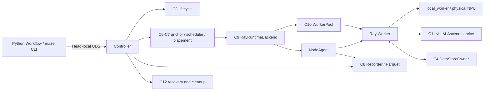

# Ascend-Maze

**English** | [中文](README.md)

Ascend-Maze is a task-level static workflow runtime for Huawei Ascend clusters. It
preserves the Maze programming model based on `@task`, named outputs, and static DAGs,
while rebuilding deterministic compilation, resource anchoring, HACS-noTP scheduling,
physical NPU placement, Standby Workers, vLLM-Ascend model serving, fault recovery,
auditable execution recording, and reproducible experiments for the Ascend platform.

> The current release is `0.1.0` Alpha. C0-C13 correctness and C14A-C14D are complete.
> The C14E experiment implementation is available, but Ascend performance calibration
> and the formal internal ablation studies are not closed. The C14F external baseline
> adapter is not implemented. There is no formal performance-benefit claim yet.

## 1. Goals and Scope

The first Ascend-Maze release implements and validates the core mechanisms described by
the Maze paper:

- task-level resource anchoring;
- heterogeneous CPU, NPU, and I/O queues;
- FCFS and HACS-noTP scheduling;
- physical NPU placement controlled exclusively by Maze;
- low-overhead execution recording and system observation;
- one-shot NPU Workers and zero-HBM Standby Workers;
- single-NPU vLLM-Ascend model serving;
- timeout, OOM, Worker, and Node fault handling with resource recovery;
- replayable and verifiable internal ablation studies.

The upstream Maze `main` branch is a reference for the public API. The experimental
`dag` branch is a reference for scheduling algorithms and experimental methodology.
Ascend-Maze is not a line-by-line port and does not treat either branch's internal
implementation as a compatibility requirement. When constraints conflict, paper
semantics, the public Task/Workflow API, and resource correctness on Ascend take
precedence.

The current scope explicitly excludes:

- a frontend, Playground, or public Web API;
- multi-user authorization, Workspace, MCP, or a general-purpose sandbox;
- dynamic ReAct/sub-DAG execution;
- multi-NPU model sharding;
- MaLearn or another runtime predictor;
- production-grade disaster recovery;
- native Ray, AutoGen, AgentScope, or other external baseline implementations.

Ray is the formal cross-node execution and Object Store backend for phase one, but it is
confined to the RuntimeBackend and DataStore adapters. Queueing, reservation, and
physical-device selection remain Ascend-Maze responsibilities. Ray must not perform a
second, independent device-placement decision.

## 2. Project Status

| Scope | Status | Notes |
|---|---|---|
| Stages 0-7 / C0-C13 | Complete | Correctness, Ray Host, real 910B3, vLLM-Ascend, and the system fault matrix are closed |
| C14A-C14D | Complete | ExperimentSpec, orchestration, formal import, aggregation, and reporting are implemented |
| C14E | In progress | Workloads, pilots, microbenchmarks, and formal Study support exist; performance settings are not frozen |
| C14F | Pending | External subprocess adapter, fake baseline, and the final reproducibility bundle |

As of 2026-07-21, the functional source baseline is
`77aa4fef0b0ccf13968e999705588e0db6887786`. The most recent full code gate included
408 regular Unit tests, 408 optimized-mode Unit tests, 58 Ray Host tests, and complete
ruff, mypy, compileall, and wheel checks.

C14E has completed one non-confirmatory low-load pilot on a real 8-card 910B3 cluster
with Qwen3-4B. All 15 Trial attempts passed formal `validate`, followed by successful
`aggregate` and `report` steps. This proves experiment-path correctness, recording
integrity, and resource recovery. It does not prove a performance benefit.

Normative product contracts, implementation records, and supplementary fault notes are
currently maintained as internal material and are not published in the temporary public
repository.

## 3. Core Capabilities

### Deterministic workflows

- Synchronous Python `def`, static DAGs, and named outputs;
- canonicalization of literals, defaults, resources, model bindings, retry and timeout
  policies, and every edge;
- stable Task IDs, topological order, canonical IR, and `workflow_fingerprint`;
- identical logical identities across processes and different `PYTHONHASHSEED` values;
- a `submission_id` contract covering the Workflow, input identities, configuration,
  and execution options, with replay and conflict rejection.

### Resources and scheduling

- ResourceAnchor separates user declarations, static profiles, and runtime observations;
- Placement reserves CPU, Host memory, I/O, NPU HBM, and NPU slots in one ledger;
- HACS-noTP, FCFS, heterogeneous partitions, and a unified-queue ablation;
- atomic Standby reservation conversion that charges only the positive difference
  between Task demand and Standby credit;
- device binding verified by the PlacementLease, NodeAgent, and Worker.

### Workers and inference serving

- NPU Tasks use one-shot Workers; Task leases are released and HBM recovery is checked
  after process exit;
- CPU and I/O Workers may be reused only after sanitization;
- `mode="service"` reaches vLLM-Ascend through a ModelRouteLease;
- `mode="local_worker"` merges model demand with incremental Task resources and loads
  the model inside the Worker;
- one Attempt may call `chat()` sequentially more than once; concurrent calls are
  rejected with a structured error.

### Faults, control, and observation

- Controller generation fencing prevents stale NodeAgent and Worker messages from
  mutating current state;
- C12 normalizes timeout, OOM, Worker, Node, data, model-service, and control faults;
- terminal Run cleanup and `destroy` use separate resource checkpoints;
- the Controller and participating NodeAgents are the persistent C8 producers;
- Parquet recording includes producer sequences, expected producers, controlled flush,
  and opaque historical cursors;
- the real-time `WatchRun` control sequence is distinct from Parquet producer sequences.

## 4. Architecture



| Component group | Responsibility |
|---|---|
| C1-C2 | Task/Workflow API, AST output contract, deterministic compilation, and immutable IR |
| C3-C4 | Run/Task/Attempt lifecycle, argument binding, DataHandle, and data ownership |
| C5-C7 | ResourceAnchor, cluster ledger, Placement, heterogeneous queues, and scheduling policies |
| C8-C10 | Execution recording, Ray RuntimeBackend, NodeAgent, Workers, and Standby |
| C11-C13 | Model instances and routes, fault recovery, Controller, UDS RuntimeClient, and CLI |
| C14 | ExperimentSpec, arrival schedules, Trial orchestration, validation, aggregation, and reporting |

All schedulable NPU nodes in phase one must use one chip family and a compatible
CANN/torch_npu environment fingerprint. A mismatching node remains `unschedulable`.

## 5. Programming Model

### Minimal static Workflow

The following file can be compiled offline. Once a Controller is running, the same
`build()` factory can be submitted through the CLI or `Workflow.run()`.

```python
# text_workflow.py
from ascend_maze import Workflow, task


@task(task_kind="cpu", resources={"cpu_num": 1, "mem": 128})
def normalize(text: str):
    return {"normalized": " ".join(text.split()).lower()}


@task(task_kind="cpu", resources={"cpu_num": 1, "mem": 128})
def count_characters(text: str):
    return {"characters": len(text)}


def build() -> Workflow:
    workflow = Workflow("text-analysis")
    text = workflow.input("text")
    normalized = workflow.add_task(
        normalize,
        inputs={"text": text},
    )
    workflow.add_task(
        count_characters,
        inputs={"text": normalized.outputs["normalized"]},
    )
    return workflow


if __name__ == "__main__":
    compiled = build().compile()
    print(compiled.workflow_fingerprint)
```

Offline compilation does not start Ray, the Controller, or an NPU:

```bash
python text_workflow.py
```

With a running Controller, submit directly from Python:

```python
from text_workflow import build

run_id = build().run(
    inputs={"text": "  Ascend Maze  "},
    submission_id="text-analysis-001",
    config_path="/path/to/controller.toml",
)
print(run_id)
```

### Phase-one Task restrictions

`@task` reads the function AST at definition time and performs conservative validation:

- the callable must be a synchronous `def` for which `inspect.isfunction()` is true;
- lambdas, bound methods, `functools.partial`, callable objects, async functions, and
  generators are unsupported;
- non-empty closures are rejected in phase one;
- every normal exit must directly return a literal `dict`;
- keys must be static strings and every normal path must use the same key set;
- `raise` paths are allowed; bare returns, fall-through, dict unpacking, and dynamic
  result variables are rejected;
- `return {}` defines a valid control-only Task. Use `workflow.add_edge()` for its
  control dependencies.

Public resource fields are `cpu_num`, `mem`, `npu_mem`, and `io_num`; memory values are
in MiB. The old `gpu_mem` name remains only as a deprecated alias.

### Data and file inputs

- A normal string is always a string. The CLI does not guess whether it is a path.
- A shared file must be below a configured shared root and use an explicit
  `SharedFileRef`.
- Large objects use the DataStore staged/adopt path rather than Workflow literals or
  UDS payloads.
- Both an individual literal and the complete CompiledWorkflow have configured byte
  limits.

An explicit shared-file input in CLI JSON has this form:

```json
{
  "model_file": {
    "$shared_file": {
      "canonical_path": "/shared/model/config.json",
      "content_sha256": "<64-hex-sha256>",
      "size_bytes": 1024
    }
  }
}
```

## 6. Execution Lifecycle

The main path of a successful submission is:

```text
RuntimeClient compiles the Workflow and builds CodePackages
    -> stage inputs
    -> Controller atomically commits the Run
    -> Tasks enter ready / queued
    -> ResourceAnchor + Scheduler + Placement
    -> create a dispatched Attempt
    -> Worker acquire / WorkerStarted
    -> Worker reads DataHandles and executes the function
    -> atomically publish Attempt outputs into RunDataIndex
    -> Tasks and Run become terminal
    -> Recorder flush
    -> destroy releases published data and Run code references
```

At Run terminal, that Run's PlacementLease, WorkerLease, RouteLease, deadlines, failed
outputs, and late outputs must be clear. Successful inputs and outputs remain readable,
and RunDataIndex remains active. Only `destroy` releases DataHandles and Run-level
CodeHandle references and transitions RunDataIndex to its final released or tombstone
state. Repeated `destroy` calls are idempotent.

## 7. Environment and Installation

### Python package

The package and command names are:

```text
Python package: ascend_maze
Control CLI:    maze
Benchmark CLI:  maze-bench
```

The project declares Python `>=3.10,<3.14`. A basic development environment can be
created with:

```bash
git clone https://github.com/guchengzhong/ascend-maze.git
cd ascend-maze
conda create -n ascend-maze python=3.10
conda activate ascend-maze
python -m pip install -e '.[dev]'
```

Install the optional Ray Host dependencies with:

```bash
python -m pip install -e '.[dev,ray-host]'
```

Before enabling real inference, install Driver, Firmware, CANN, PyTorch, torch_npu, ATB,
vLLM, and vLLM-Ascend according to the official Ascend compatibility matrix. This
repository does not install those platform components and does not download models.
The `inference-vllm` extra installs only the HTTP and metrics client dependencies:

```bash
python -m pip install -e '.[dev,ray-host,inference-vllm]'
```

Do not overwrite the platform `PYTHONPATH` merely to run the source tree. The CANN `acl`
Python module commonly depends on the environment supplied by the platform installation.

### Verified reference environment

The following snapshot was used for current correctness gates and the C14E pilot. It is
not a complete compatibility matrix.

| Item | Verified value |
|---|---|
| Architecture | aarch64 |
| NPU | 8 x Ascend 910B3, 64 GiB HBM/card, all-HCCS topology |
| Python | 3.10.20 |
| Driver / Firmware | 25.3.rc1 / 7.8.0.2.212 |
| CANN / ATB | 9.0.0-beta.2 / 9.0.0 |
| PyTorch / torch_npu | 2.7.1+cpu / 2.7.1.post2 |
| Ray / cloudpickle | 2.55.1 / 3.1.2 |
| vLLM / vLLM-Ascend | 0.11.0+empty / 0.11.0 |
| Experiment model | Qwen3-4B, single-NPU service mode |

Every schedulable node must use matching project code, protocol versions, and environment
fingerprints.

## 8. Configuration and Deployment

The Controller uses a versioned global TOML configuration with these main sections:

```text
[control]       UDS, runtime, token, recovery, and shutdown
[workflow]      literal-size limits
[data]          explicit shared-filesystem roots
[cluster]       cluster identity, Head, and environment fingerprint
[runtime.ray]   namespace, temporary directory, and Object Store
[scheduler]     policy, partitioner, and lookahead
[placement]     slots, colocation, and HBM headroom
[worker]        Standby, Worker limits, and recovery deadlines
[inference]     ModelCatalog and reconciliation
[recording]     backend, queues, Parquet, and flush
[fault]         retry and backoff
```

Each NodeAgent uses a separate, minimal bootstrap TOML containing node identity, the
Controller endpoint, token file, Ray/Worker directories, and Recorder directory. It
cannot carry an independent scheduling policy.

[experiments/c14e/performance.candidate.toml](../experiments/c14e/performance.candidate.toml)
is a C14E experiment candidate. It is not a frozen production default and must not be
used directly to support a formal performance claim.

A typical startup order is shown below. Controller and NodeAgent commands are long-lived
processes and should be managed by a service manager or separate terminals in a real
deployment.

```bash
maze config validate --config /path/to/controller.toml
maze doctor --config /path/to/controller.toml
maze controller start --config /path/to/controller.toml

# Run on each participating node
maze node start --config /path/to/node.toml

maze cluster status --config /path/to/controller.toml
maze models wait-ready qwen3-4b --config /path/to/controller.toml
```

Equivalent module entry points are available from a source checkout:

```bash
python -m ascend_maze.cli.main --help
python -m ascend_maze.benchmark.cli --help
```

## 9. CLI Usage

| Command group | Main purpose |
|---|---|
| `maze config validate/render` | Validate configuration and inspect normalized values |
| `maze doctor` | Perform read-only environment, path, device, and dependency checks |
| `maze controller start/status/stop` | Controller lifecycle |
| `maze node start/status/drain/resume` | NodeAgent lifecycle and node isolation |
| `maze cluster status/nodes/resources/queues/workers` | Cluster snapshots and watch |
| `maze run submit/list/show/watch/events/result/cancel/destroy` | Complete Workflow Run lifecycle |
| `maze models validate/list/status/wait-ready` | ModelCatalog and instance state |
| `maze recording status/flush` | C8 Writer status and controlled flush |

Submit the earlier `text_workflow.py` example:

```bash
cat > inputs.json <<'JSON'
{"text":"  Ascend Maze  "}
JSON

maze --json run submit ./text_workflow.py:build \
  --inputs ./inputs.json \
  --submission-id text-analysis-001 \
  --config /path/to/controller.toml
```

Use the returned `run_id` for subsequent operations:

```bash
maze run watch RUN_ID --config /path/to/controller.toml
maze run show RUN_ID --config /path/to/controller.toml
maze run events RUN_ID --limit 100 --config /path/to/controller.toml
maze run result RUN_ID --task TASK_ID --config /path/to/controller.toml
maze run destroy RUN_ID --config /path/to/controller.toml
```

`run watch` uses the Controller control-event sequence. `run events --cursor TOKEN`
paginates committed Parquet. They are separate cursor protocols.

## 10. Reproducible Experiments

`maze-bench` is separate from the operational control CLI:

```bash
maze-bench plan SPEC.toml
maze-bench run SPEC.toml --output-root experiment_output
maze-bench resume STUDY_DIRECTORY
maze-bench validate STUDY_DIRECTORY
maze-bench aggregate STUDY_DIRECTORY
maze-bench report STUDY_DIRECTORY
```

Additional C14E commands include:

```bash
maze-bench admit SPEC.toml
maze-bench prepare-14e --config CONFIG.toml \
  --output-directory SPECS --study-kind pilot \
  --rate 0.25 --rate 0.5 --rate 0.75
maze-bench microbenchmark --output-root OUTPUT
```

The only formal analysis path is:

```text
run/resume -> validate -> aggregate -> report
```

Do not aggregate or make a performance claim when `validate` fails. C14 consumes only
the formal `FlushResult.committed_files` listed by TrialManifest and validates file
digests, Parquet schemas, producer sequences, Run/Task/Attempt/Lease associations, and
resource recovery.

A pilot contains at least three paired blocks and is used only for load, window, and
capacity calibration. A formal internal ablation uses at least three Poisson load points
and at least ten complete paired blocks per load point, with these Cells:

- `maze_full`;
- `fcfs`;
- `no_resource_anchor`;
- `no_heterogeneous_queue`;
- `no_standby`.

A report may legitimately conclude no benefit, a negative effect, budget failure, or
insufficient samples. The primary analysis performs no automatic outlier deletion, no
winsorization, and no selective rerun of valid slow Trials. A formal P99 claim requires
at least 100 Runs in every valid Trial and at least 1,000 valid Runs in the Study.

## 11. Correctness, Security, and Privacy

- Staged inputs are adopted by RunDataIndex only after the SubmitWorkflow commit point.
- The same `submission_id` and payload return the original `run_id`; a changed payload
  is an explicit conflict.
- A DataHandle is bound to its owner generation. An old-generation handle never reads a
  new object silently.
- PlacementLease, WorkerLease, and RouteLease each have explicit acquisition,
  conversion, and release paths.
- Failed and late outputs cannot overwrite the successful Attempt.
- NodeAgent producer identities contain generations, so Controller and Trial sequence
  spaces are not reused.
- Workers do not write Parquet directly; they send events to the NodeAgent Recorder.
- Default execution events do not contain prompts, generated text, Tensor or file
  contents, credentials, or Task return values.
- The C14 Qwen workload persists only response digests and token/byte counts.
- Tokens, private keys, models, Parquet, caches, and experiment outputs are excluded by
  `.gitignore`.

Ascend-Maze is not currently a multi-tenant security boundary. User Tasks are trusted
code. A public deployment needs external identity, authorization, network isolation,
and secret management.

## 12. Repository Layout

```text
src/ascend_maze/
    api/            Task and Workflow API
    compiler/       AST analysis, canonical IR, and fingerprinting
    lifecycle/      Run/Task/Attempt state machines
    data/           InMemory and Ray DataStores
    resources/      ResourceAnchor
    placement/      cluster ledger and PlacementLease
    scheduler/      FCFS, HACS-noTP, and partitioners
    runtime/        Fake/Ray RuntimeBackend and Workers
    inference/      model instances, RouteLease, and adapters
    fault/          error normalization, policy, and cleanup barriers
    recording/      InMemory and Parquet Recorders
    control/        Controller, NodeAgent, UDS, and gRPC
    cli/            maze CLI
    benchmark/      C14 planning, orchestration, import, statistics, and reports

tests/              Unit and fake-e2e tests without Ray or NPU
tests_ray_host/     real Ray multi-process Host tests
tests_ascend/       real Ascend device gates
experiments/        executable admission experiments and C14E candidate configuration
doc/todo/           normative contracts and implementation evidence
refs/               local reference code, excluded from Git
```

`FakeRuntimeBackend` is a deterministic test double that validates the same submission,
scheduling, data, and fault contracts without Ray or an NPU. It is not a formal cluster
backend.

## 13. Testing and Building

Hardware-independent checks:

```bash
python -m pytest -q tests
python -O -m pytest -q tests
ruff check src tests tests_ray_host
mypy src
python -m compileall -q src
```

Ray Host gate:

```bash
python -m pytest -q tests_ray_host
```

The Ascend gate requires the target hardware and frozen environment:

```bash
python -m pytest -q tests_ascend
```

Build a wheel without installing new dependencies:

```bash
python -m pip wheel . --no-deps --no-build-isolation --wheel-dir dist
```

When a required hardware environment is unavailable, the gate remains incomplete. It
must not be converted into an optional pass.

## 14. Current Limitations and Roadmap

Current limitations:

- only static DAGs with a fully declared topology are supported;
- Task callable and output analysis use a conservative AST allowlist;
- schedulable NPU nodes must use a compatible homogeneous environment;
- model serving is single-NPU in phase one and does not support model sharding;
- ordinary path strings are not distributed implicitly;
- HACS-noTP uses `T_pred=1.0` and does not include MaLearn;
- the performance profile has not been frozen by a formal C14E Study;
- external baselines are unavailable, so reports cannot claim superiority over native
  Ray.

Planned order of work:

1. complete C14E load, window, Standby, slot, HBM, and vLLM capacity calibration;
2. run C7/C8/C12/C13 microbenchmarks and evaluate their hard budgets;
3. complete the formal five-Cell Study on real 910B3/Qwen3-4B;
4. freeze performance defaults only after stability and budget gates pass;
5. implement the C14F external adapter and fake baseline;
6. produce cross-system conclusions only after an independent native Ray baseline is
   available.

## 15. Documentation and License

- [../pyproject.toml](../pyproject.toml): packaging, dependencies, entry points, and tool configuration.

The normative C0-C14 product contracts, implementation order, hard gates, acceptance
evidence, and supplementary fault notes are currently maintained as internal material
and are not included in the temporary public repository.

The project is licensed under the MIT License. It is currently in the research and
systems-validation stage. Alpha status and pilot results must not be represented as
production readiness or a formal performance commitment.
